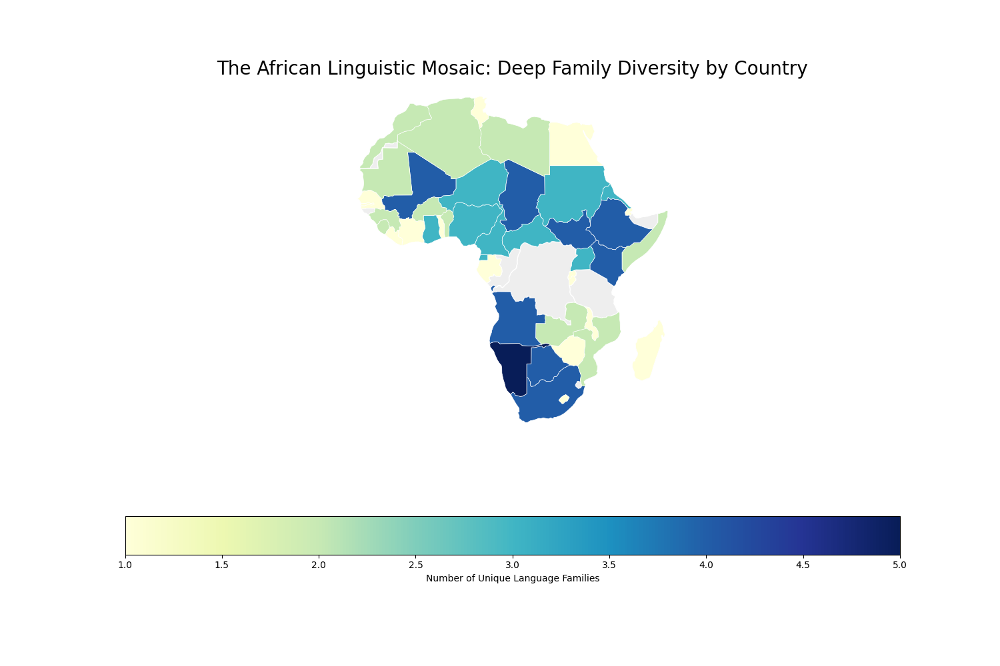
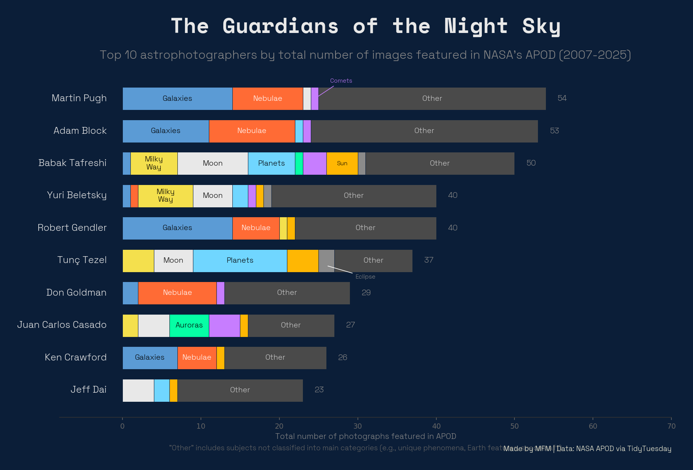

# tidytuesdays

This is a repo with my contributions to the [TidyTuesday challenge](https://github.com/rfordatascience/tidytuesday), **and then some**.

## Reproducibility

I have tried to make the code as reproducible as possible. The easiest way is to use [uv](https://docs.astral.sh/uv/).

```bash
uv python install
uv sync
```

Then you can run any of the scripts in the `src` folder.

```bash
uv run src/2025/2025-03-04/main.py
```

<br><br>

## Visualizations


#### 2026-01-13 - Languages of Africa



#### 2026-01-20 - Top 10 astrophotographers


